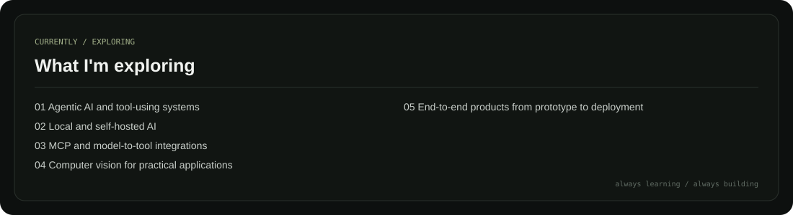
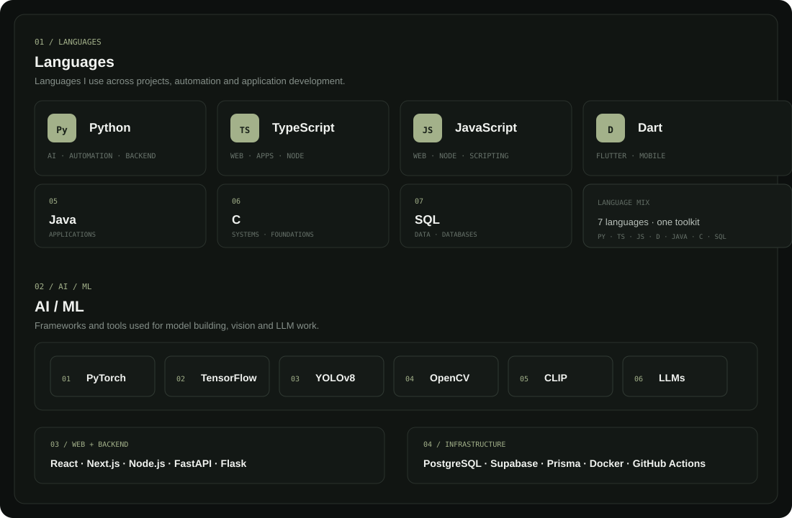
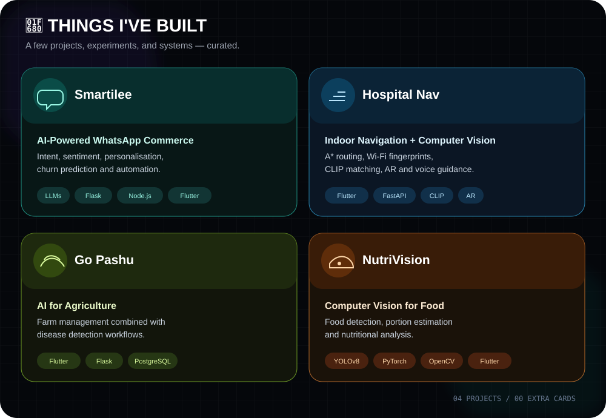

  
  
  

---

## whoami

I'm **Arjun**, a Computer Science student who likes turning messy real-world problems into software that people can actually use.

My work moves between **AI/ML, computer vision, backend engineering, product development and systems**.

> Build useful things. Learn by shipping. Make the next version better.

---

## The Playground

---

## What I'm Exploring

---

## Stack

---

## Things I've Built

---

## GitHub contributions

---

## GitHub streak & stats

<table>
<tr>
<td>

</td>
<td>

</td>
</tr>
</table>

---

## Build philosophy

<b>IDEA → UNDERSTAND → BUILD → CONNECT → SHIP</b>

  

Start with the problem. 
Build the smallest useful core. 
Connect the pieces. 
Ship it and learn from the next version.

---

### Have an interesting idea?

**I'd rather build it than make a slide deck about building it.**

 

<a href="https://github.com/arjun1Fa">GitHub</a>
&nbsp; • &nbsp;
<a href="mailto:culerarjun@gmail.com">Email</a>
&nbsp; • &nbsp;
<a href="https://instagram.com/_winter.a_">Instagram</a>

  

<i>good ideas deserve good execution.</i>

