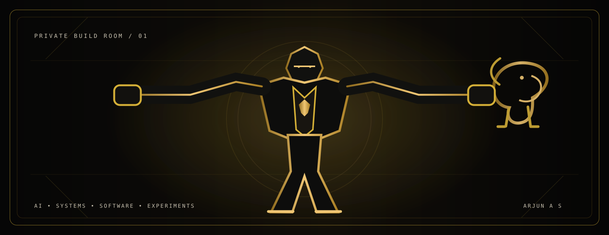

<div align="center">

<br>



<br><br>

<table>
<tr>
<td align="center">

# ARJUN A S

<sub><b>AI / ML</b> &nbsp;•&nbsp; <b>COMPUTER VISION</b> &nbsp;•&nbsp; <b>BACKEND</b> &nbsp;•&nbsp; <b>FULL-STACK</b> &nbsp;•&nbsp; <b>LOCAL AI</b></sub>

<br><br>

<sub>
I build useful systems, chase strange ideas, and usually end up somewhere between
<br>
AI, software and things that probably should have been a little simpler.
</sub>

<br><br>

<a href="https://github.com/arjun1Fa">GITHUB</a>
&nbsp;&nbsp;•&nbsp;&nbsp;
<a href="mailto:culerarjun@gmail.com">EMAIL</a>
&nbsp;&nbsp;•&nbsp;&nbsp;
<a href="https://instagram.com/_winter.a_">INSTAGRAM</a>

</td>
</tr>
</table>

<br>

> **build quietly. ship loudly.**

</div>

---

# THE WORK

I like working across the stack rather than treating AI as a standalone box.

A project can start with a model, become an API, turn into a mobile app, pick up a database, and somehow end up as a complete product.

My work lives around **AI, software engineering, systems, and real-world problems**.

---

# DOMAINS

<table>
<tr>
<td width="25%" align="center">

**01**

### AI / ML

Machine Learning  
Deep Learning  
LLM Applications  
AI Systems

</td>
<td width="25%" align="center">

**02**

### COMPUTER VISION

Object Detection  
Image Understanding  
YOLO / OpenCV  
Multimodal AI

</td>
<td width="25%" align="center">

**03**

### LOCAL AI

Local LLMs  
AI Agents  
Private AI  
Model Deployment

</td>
<td width="25%" align="center">

**04**

### BACKEND

REST APIs  
Realtime Services  
Business Logic  
System Architecture

</td>
</tr>

<tr>
<td align="center">

**05**

### FRONTEND

React  
Next.js  
TypeScript  
Web Applications

</td>
<td align="center">

**06**

### MOBILE

Flutter  
Dart  
Camera / Sensors  
Mobile AI

</td>
<td align="center">

**07**

### DATA

PostgreSQL  
Supabase  
Prisma  
Data Modelling

</td>
<td align="center">

**08**

### CLOUD / DEVOPS

Docker  
GitHub Actions  
Deployment  
Infrastructure

</td>
</tr>

<tr>
<td align="center">

**09**

### DISTRIBUTED SYSTEMS

WebSockets  
Networking  
Service Integration  
Realtime Communication

</td>
<td align="center">

**10**

### AUTOMATION

Background Jobs  
Workflow Automation  
APIs  
Developer Tooling

</td>
<td align="center">

**11**

### ACCESSIBILITY

Assistive Software  
Braille Systems  
Human-Centred Tools  
Practical AI

</td>
<td align="center">

**12**

### RAPID PROTOTYPING

Hackathons  
Experiments  
Proof of Concepts  
Product Builds

</td>
</tr>
</table>

---

# SELECTED WORK

<div align="center">

### CET × ARMADA
**SATELLITE MESH COMMUNICATION**

</div>

A systems-heavy hackathon project exploring **satellite mesh communication** and resilient distributed networking.

`Go` `Networking` `Distributed Systems`

<br>

<div align="center">

### SMARTILEE
**AI-POWERED WHATSAPP COMMERCE**

</div>

An AI commerce platform built around customer conversations — **intent detection, sentiment, personalized responses, churn prediction, automated follow-ups and human handoff**.

`LLMs` `Flask` `Node.js` `Supabase` `Flutter`

<br>

<div align="center">

### MEETILY / LOCAL AI
**PRIVACY-FIRST MEETING INTELLIGENCE**

</div>

Work around **local-first meeting intelligence**, on-device transcription, summarization and self-hosted AI workflows.

`Local AI` `Whisper` `LLMs` `AI Systems`

<br>

<div align="center">

### HOSPITAL NAV
**INDOOR NAVIGATION + COMPUTER VISION**

</div>

A navigation system combining **A* routing, WiFi fingerprinting, CLIP-based visual matching, AR wayfinding and voice guidance**.

`Flutter` `FastAPI` `CLIP` `A*` `AR`

<br>

<div align="center">

### GO PASHU
**AI FOR FARMERS**

</div>

A mobile-first system combining **farm management and disease detection** for a practical agriculture workflow.

`Flutter` `Flask` `PostgreSQL`

<br>

<div align="center">

### NUTRIVISION
**COMPUTER VISION FOR FOOD**

</div>

An early deep dive into **food detection, portion estimation and nutritional analysis** using a mobile camera.

`YOLOv8` `PyTorch` `OpenCV` `Flutter`

---

# HOW I BUILD

```text
             idea
              │
              ▼
         "this could work"
              │
              ▼
          prototype
              │
              ▼
      architecture gets weird
              │
              ▼
            build
              │
              ▼
            break
              │
              ▼
             fix
              │
              ▼
            ship
```

I care about the complete system — not just the model, not just the UI, and not just the API.

---

# TOOLBOX

<table>
<tr>
<td width="50%">

### LANGUAGES

`Python` `TypeScript` `JavaScript`  
`Dart` `Java` `C` `SQL`

### AI / ML

`PyTorch` `TensorFlow` `YOLOv8`  
`OpenCV` `CLIP` `LLMs`

### FRONTEND

`React` `Next.js` `Flutter`  
`Tailwind CSS`

</td>

<td width="50%">

### BACKEND

`Node.js` `FastAPI` `Flask` `Express`

### DATA

`PostgreSQL` `Supabase` `Prisma`

### INFRASTRUCTURE

`Docker` `GitHub Actions` `Vercel`

### TOOLS

`Git` `Postman` `Figma`

</td>
</tr>
</table>

---

# GITHUB — THE LEDGER

<div align="center">

### ALL-TIME COMMIT HISTORY


<br><br>


<br><br>


<br><br>


</div>

---

# CONTRIBUTION NOTE

The main statistics card is configured with `include_all_commits=true`, so the commit count is intended to represent **all available commit history**, rather than only the current year.

The activity graph is shown separately so that **history** and **recent activity** are not presented as the same metric.

---

<div align="center">

<br>


<br><br>

### LET'S BUILD SOMETHING INTERESTING.

<a href="https://github.com/arjun1Fa">GITHUB</a>
&nbsp;&nbsp;•&nbsp;&nbsp;
<a href="mailto:culerarjun@gmail.com">EMAIL</a>
&nbsp;&nbsp;•&nbsp;&nbsp;
<a href="https://instagram.com/_winter.a_">INSTAGRAM</a>

<br><br>

<sub>good ideas deserve good execution.</sub>

<br><br>

**01 — BUILD &nbsp;&nbsp; 02 — BREAK &nbsp;&nbsp; 03 — FIX &nbsp;&nbsp; 04 — SHIP**

</div>
