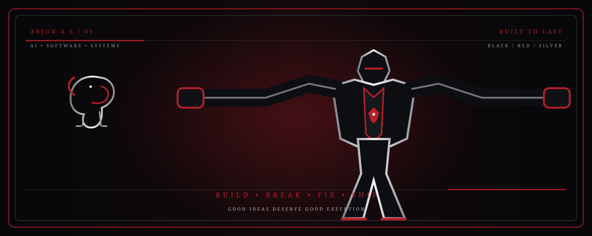
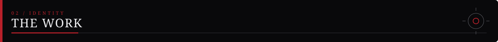
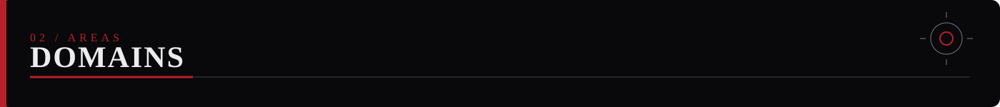
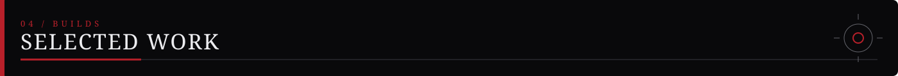
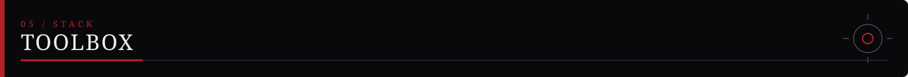
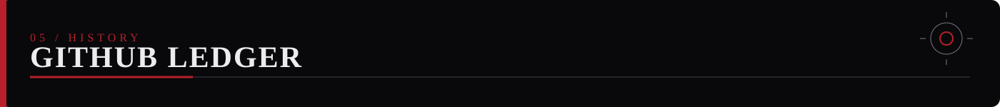

  

### AI / ML &nbsp;•&nbsp; COMPUTER VISION &nbsp;•&nbsp; BACKEND &nbsp;•&nbsp; FULL-STACK &nbsp;•&nbsp; LOCAL AI

 

I build useful systems, experiment with ambitious ideas, and move between models, APIs, products and infrastructure.

  

<a href="https://github.com/arjun1Fa">GITHUB</a>
&nbsp;•&nbsp;
<a href="mailto:culerarjun@gmail.com">EMAIL</a>
&nbsp;•&nbsp;
<a href="https://instagram.com/_winter.a_">INSTAGRAM</a>

 

I work across the stack rather than treating AI as a standalone box.

A project can begin with a model, become an API, turn into a mobile or web application, pick up a database, and eventually become a complete system.

The common thread is simple:

> **take a real problem, understand the system around it, and build the thing.**

---

<table>
<tr>
<td width="25%" align="center">

**01**

### AI / ML

Machine Learning  
Deep Learning  
LLM Applications  
AI Systems

</td>
<td width="25%" align="center">

**02**

### COMPUTER VISION

Object Detection  
Image Understanding  
YOLO / OpenCV  
Multimodal AI

</td>
<td width="25%" align="center">

**03**

### LOCAL AI

Local LLMs  
AI Agents  
Private AI  
Model Deployment

</td>
<td width="25%" align="center">

**04**

### BACKEND

REST APIs  
Realtime Services  
Business Logic  
System Architecture

</td>
</tr>

<tr>
<td align="center">

**05**

### FRONTEND

React  
Next.js  
TypeScript  
Web Applications

</td>
<td align="center">

**06**

### MOBILE

Flutter  
Dart  
Camera / Sensors  
Mobile AI

</td>
<td align="center">

**07**

### DATA

PostgreSQL  
Supabase  
Prisma  
Data Modelling

</td>
<td align="center">

**08**

### CLOUD / DEVOPS

Docker  
GitHub Actions  
Deployment  
Infrastructure

</td>
</tr>

<tr>
<td align="center">

**09**

### SYSTEMS

WebSockets  
Networking  
Service Integration  
Realtime Communication

</td>
<td align="center">

**10**

### AUTOMATION

Background Jobs  
Workflow Automation  
APIs  
Developer Tooling

</td>
<td align="center">

**11**

### ACCESSIBILITY

Assistive Software  
Braille Systems  
Human-Centred Tools  
Practical AI

</td>
<td align="center">

**12**

### PROTOTYPING

Hackathons  
Experiments  
Proof of Concepts  
Product Builds

</td>
</tr>
</table>

---

### CET × ARMADA
**SATELLITE MESH COMMUNICATION**

A systems-oriented hackathon project exploring satellite mesh communication and resilient distributed networking.

`Go` `Networking` `Distributed Systems`

 

### SMARTILEE
**AI-POWERED WHATSAPP COMMERCE**

An AI commerce platform focused on customer intent, sentiment, personalised responses, churn prediction, automated follow-ups and human handoff.

`LLMs` `Flask` `Node.js` `Supabase` `Flutter`

 

### MEETILY / LOCAL AI
**PRIVACY-FIRST MEETING INTELLIGENCE**

Work around local-first meeting intelligence, on-device transcription, summarisation and self-hosted AI workflows.

`Local AI` `Speech` `LLMs` `AI Systems`

 

### HOSPITAL NAV
**INDOOR NAVIGATION + COMPUTER VISION**

A navigation system combining A* routing, WiFi fingerprinting, CLIP-based visual matching, AR wayfinding and voice guidance.

`Flutter` `FastAPI` `CLIP` `A*` `AR`

 

### GO PASHU
**AI FOR AGRICULTURE**

A mobile-first system combining farm management and disease detection into a practical workflow for farmers.

`Flutter` `Flask` `PostgreSQL`

 

### NUTRIVISION
**COMPUTER VISION FOR FOOD**

A computer-vision project exploring food detection, portion estimation and nutritional analysis from a mobile camera.

`YOLOv8` `PyTorch` `OpenCV` `Flutter`

---

<table>
<tr>
<td width="50%">

### LANGUAGES

`Python` `TypeScript` `JavaScript`  
`Dart` `Java` `C` `SQL`

### AI / ML

`PyTorch` `TensorFlow` `YOLOv8`  
`OpenCV` `CLIP` `LLMs`

### FRONTEND

`React` `Next.js` `Flutter`  
`Tailwind CSS`

</td>
<td width="50%">

### BACKEND

`Node.js` `FastAPI` `Flask` `Express`

### DATA

`PostgreSQL` `Supabase` `Prisma`

### INFRASTRUCTURE

`Docker` `GitHub Actions` `Vercel`

### TOOLS

`Git` `Postman` `Figma`

</td>
</tr>
</table>

---

### ALL-TIME COMMIT HISTORY

  

 

> **The commit statistic above is configured with `include_all_commits=true` so the card is based on the available all-history commit data rather than only the current year.**

---

### HAVE AN INTERESTING IDEA?

I'd rather build it than make a slide deck about building it.

  

<a href="https://github.com/arjun1Fa">GITHUB</a>
&nbsp;•&nbsp;
<a href="mailto:culerarjun@gmail.com">EMAIL</a>
&nbsp;•&nbsp;
<a href="https://instagram.com/_winter.a_">INSTAGRAM</a>

  

<i>good ideas deserve good execution.</i>

