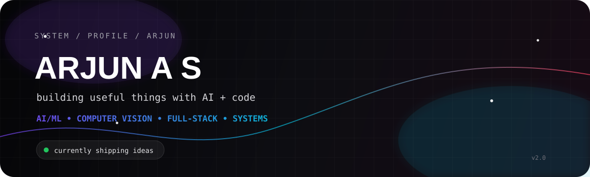
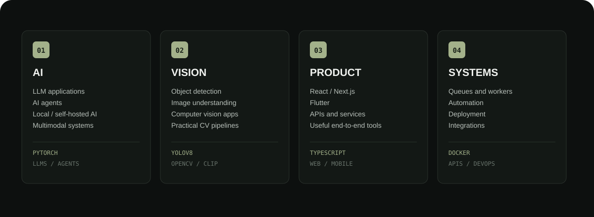
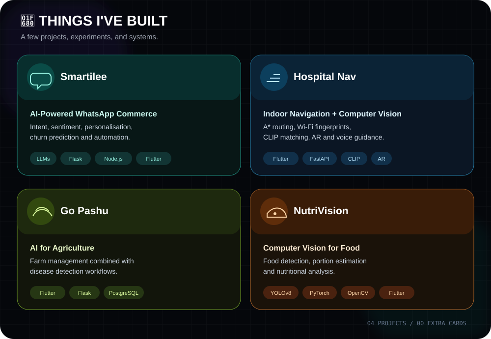
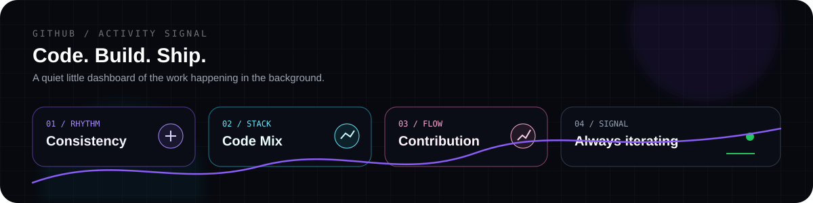
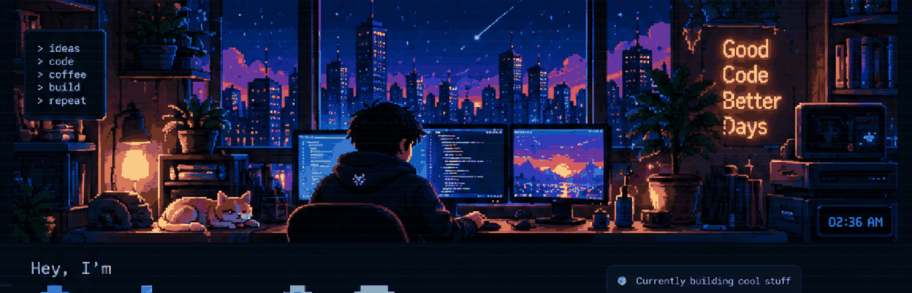

 

  
  
  

---

## ⚡ whoami

I'm **Arjun**, a Computer Science student who enjoys turning messy real-world problems into software that actually works.

My work moves across **AI/ML, computer vision, backend engineering, product development and systems** rather than staying inside one box.

> **Build useful things. Learn by shipping. Make the next version better.**

---

## 🧠 The Playground

---
 
## 🎮 Interactive Zone

<b>🔮 What am I exploring right now?</b>

 

- **Agentic AI** — systems that can reason, use tools and execute workflows
- **Local / self-hosted AI** — privacy-first model deployment
- **MCP** — connecting models to tools and real systems
- **Computer Vision** — making camera-based applications actually useful
- **End-to-end products** — taking ideas from prototype to deployment

<b>🧰 My stack, by layer</b>

 

**Languages**

<code>Python</code> <code>TypeScript</code> <code>JavaScript</code> <code>Dart</code> <code>Java</code> <code>C</code> <code>SQL</code>

**AI / ML**

<code>PyTorch</code> <code>TensorFlow</code> <code>YOLOv8</code> <code>OpenCV</code> <code>CLIP</code> <code>LLMs</code>

**Web / Backend**

<code>React</code> <code>Next.js</code> <code>Node.js</code> <code>FastAPI</code> <code>Flask</code> <code>Express</code>

**Mobile**

<code>Flutter</code> <code>Dart</code>

**Data / Infrastructure**

<code>PostgreSQL</code> <code>Supabase</code> <code>Prisma</code> <code>Docker</code> <code>GitHub Actions</code>

---

## 🚀 Things I’ve Built

> Explore the repositories to see the code, experiments, and systems behind these builds.

---

## 📡 GitHub Activity

  

  

---

## 🧪 Current Build Philosophy

<h3>IDEA → UNDERSTAND → BUILD → CONNECT → SHIP 🚀</h3>

---

### Have an interesting idea?

**I’d rather build it than make a slide deck about building it.**

 

<a href="https://github.com/arjun1Fa">GitHub</a>
&nbsp; • &nbsp;
<a href="mailto:culerarjun@gmail.com">Email</a>
&nbsp; • &nbsp;
<a href="https://instagram.com/_winter.a_">Instagram</a>

  

<i>good ideas deserve good execution.</i>

