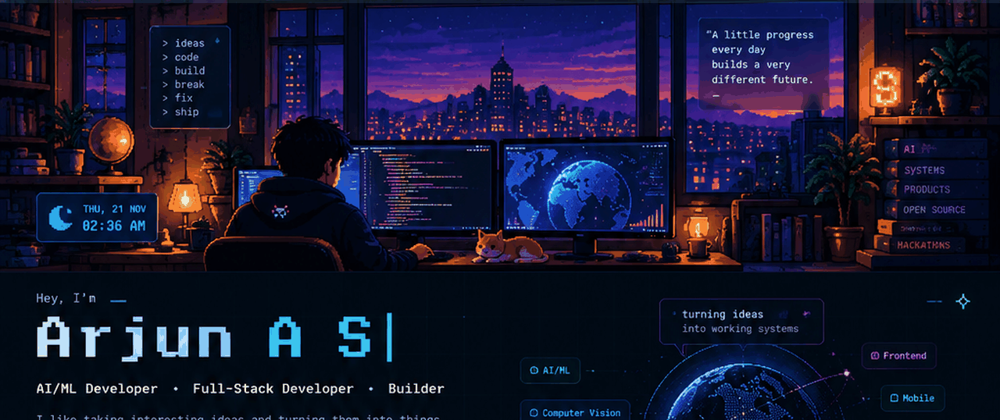

<div align="center">

<br>



<br><br>

# ARJUN A S

### AI / ML  ·  SOFTWARE  ·  SYSTEMS

<sub>computer vision • backend • full-stack • local AI • mobile • distributed systems</sub>

<br><br>

<a href="mailto:culerarjun@gmail.com">email</a>
&nbsp;&nbsp;·&nbsp;&nbsp;
<a href="https://github.com/arjun1Fa">github</a>
&nbsp;&nbsp;·&nbsp;&nbsp;
<a href="https://instagram.com/_winter.a_">instagram</a>

<br><br>

<sub><code>turning ideas into systems</code></sub>

<br><br>

</div>

---

## 01 / who i am

I’m a computer science student who likes building at the intersection of **AI and software engineering**.

I work across the stack rather than staying inside one niche: sometimes that means training a vision model, sometimes designing an API, sometimes wiring realtime services together, and sometimes figuring out how to get the whole thing running on an actual device.

Most of the things I build start with one question:

> **can this make something easier, smarter, or more useful?**

---

## 02 / domains i work in

<table>
<tr>
<td width="25%" valign="top">

### AI / ML

Machine Learning  
Deep Learning  
LLM Applications  
AI Products

</td>
<td width="25%" valign="top">

### Computer Vision

Object Detection  
Image Understanding  
YOLO / OpenCV  
Multimodal AI

</td>
<td width="25%" valign="top">

### Local AI

Local LLMs  
AI Agents  
Private AI  
Model Deployment

</td>
<td width="25%" valign="top">

### Backend

REST APIs  
Service Architecture  
Realtime Systems  
Business Logic

</td>
</tr>
<tr>
<td valign="top">

### Frontend

React  
Next.js  
TypeScript  
Web Applications

</td>
<td valign="top">

### Mobile

Flutter  
Dart  
Camera / Sensors  
On-device AI

</td>
<td valign="top">

### Data

PostgreSQL  
Supabase  
Prisma  
Data Modelling

</td>
<td valign="top">

### Cloud / DevOps

Docker  
GitHub Actions  
Deployment  
Infrastructure

</td>
</tr>
<tr>
<td valign="top">

### Distributed Systems

WebSockets  
Networking  
Service Integration  
Realtime Communication

</td>
<td valign="top">

### Automation

Background Jobs  
Workflow Automation  
APIs  
Developer Tooling

</td>
<td valign="top">

### Accessibility

Assistive Software  
Braille Systems  
Human-centred Tools  
Practical AI

</td>
<td valign="top">

### Rapid Prototyping

Hackathons  
Experiments  
Proof of Concepts  
Product Builds

</td>
</tr>
</table>

---

## 03 / selected work

<table>
<tr>
<td width="50%" valign="top">

### SMARTILEE

**AI-powered WhatsApp commerce**

A full-stack AI system for customer conversations, intent detection, personalized replies, churn prediction, automated follow-ups and human handoff.

`LLMs` `Python` `Node.js` `Supabase`

</td>
<td width="50%" valign="top">

### HOSPITAL NAV

**Indoor navigation for complex buildings**

A navigation system combining graph routing, WiFi fingerprinting, CLIP-based visual matching, AR wayfinding and voice guidance.

`Flutter` `FastAPI` `A*` `CLIP`

</td>
</tr>
<tr>
<td width="50%" valign="top">

### GO PASHU

**Technology for farm management**

A mobile-first system combining farm management with disease detection, built around a Flutter client and Python backend.

`Flutter` `Flask` `PostgreSQL`

</td>
<td width="50%" valign="top">

### MEETILY / LOCAL AI

**Privacy-first meeting intelligence**

Work around local transcription, summarization, self-hosted AI workflows and what happens when useful AI runs closer to the user.

`Local AI` `Speech` `LLMs` `AI Systems`

</td>
</tr>
<tr>
<td width="50%" valign="top">

### NUTRIVISION

**Computer vision for food intelligence**

Food detection, portion estimation and nutritional analysis through a mobile-oriented computer vision pipeline.

`YOLOv8` `PyTorch` `OpenCV` `Flutter`

</td>
<td width="50%" valign="top">

### CET × ARMADA

**Satellite mesh communication**

A hackathon project exploring mesh-based satellite communication, networking and distributed communication systems.

`Go` `Networking` `Distributed Systems`

</td>
</tr>
</table>

---

## 04 / the kind of engineering i enjoy

I like projects where the interesting part is **underneath the interface**.

A good project, to me, usually has some combination of:

```text
an actual problem
      +
interesting constraints
      +
multiple pieces that need to talk to each other
      +
something worth learning
      =
worth building
```

That is why my projects jump between **models, APIs, mobile apps, databases, realtime systems, networking and infrastructure**.

---

## 05 / toolkit

<table>
<tr>
<td width="50%" valign="top">

**Languages**  
`Python` `TypeScript` `JavaScript` `Dart` `Java` `C` `SQL`

**AI / ML**  
`PyTorch` `TensorFlow` `YOLOv8` `OpenCV` `CLIP` `LLMs`

**Frontend**  
`React` `Next.js` `Flutter` `Tailwind CSS`

</td>
<td width="50%" valign="top">

**Backend**  
`Node.js` `FastAPI` `Flask` `Express`

**Data**  
`PostgreSQL` `Supabase` `Prisma`

**Infrastructure / Tools**  
`Docker` `GitHub Actions` `Git` `Postman` `Figma`

</td>
</tr>
</table>

---

## 06 / git history

<div align="center">

### TOTAL COMMITS · ALL HISTORY


<br><br>


<br><br>


</div>

> The stats card uses `include_all_commits=true`, so the commit figure is configured for the all-history total supported by the service, rather than only the current year.

---

## 07 / outside the code

A lot of my development happens through **hackathons, technical communities, collaborative builds and experiments**.

I enjoy the parts of software that don’t fit neatly into one technology box — designing the idea, figuring out the architecture, building the thing, and then finding out what breaks first.

---

<div align="center">

<br>

### let’s build something interesting.

<br>

<a href="mailto:culerarjun@gmail.com">email</a>
&nbsp;&nbsp;·&nbsp;&nbsp;
<a href="https://github.com/arjun1Fa">github</a>
&nbsp;&nbsp;·&nbsp;&nbsp;
<a href="https://instagram.com/_winter.a_">instagram</a>

<br><br>

<sub><code>build → break → fix → repeat</code></sub>

<br><br>

</div>
